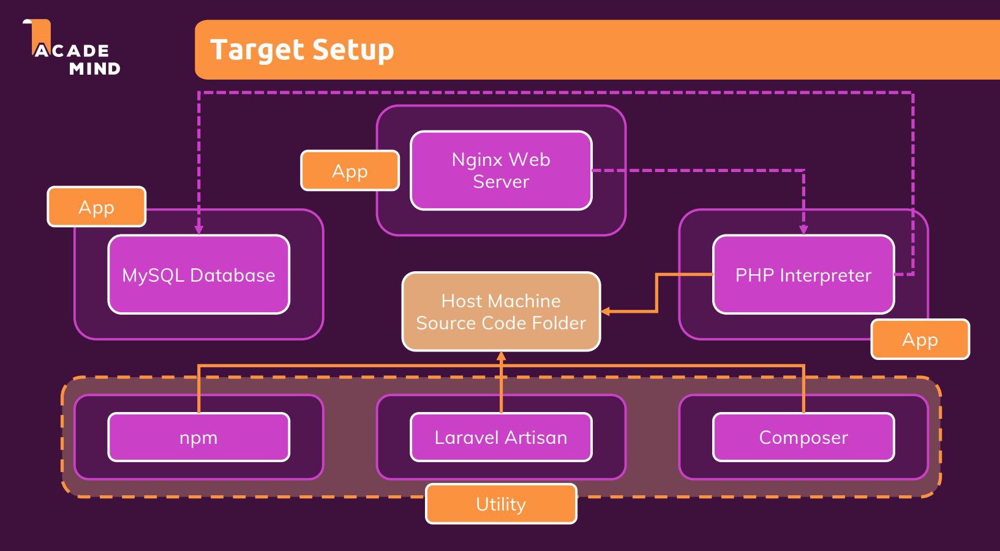

# Dockerizing Proejct


## 도커화 프로젝트
Docker Compose를 사용해 Laravel & PHP 환경 구축 해보기

### 애플리케이션 컨테이너   
- Nginx Web Server Container
- MySQl Database Container
- PHP Interpreter Container

### 유틸리티 컨테이너
  - Compser Container
  - Laravel Artisan Container
  - npm Container  

**유틸리티 컨테이너란?** 특정 환경만 포함하고 있는 컨테이너입니다.  
**유틸리티 컨테이너를 사용하는 이유 :** 
로컬에 직접 환경을 구성하려면 종속적인 부분에 대해서 생각해야하고, 부가적인 툴도 설치해줘야 해서 번거롭습니다. 하지만 유틸리티 컨테이너를 사용하면 로컬에 환경을 따로 설치하지 않고 특정 명령어를 수행할 수 있습니다.

---

<br>

### 유틸리티 컨테이너 사용 예제  
scr 폴더의 Laravel 프로젝트에 관련된 파일들은 Composer Container 환경을 이용해 생성할 수 있습니다.

```shell
docker compose run --rm composer create-project laravel/laravel [도커 컨테이너 내부 - 프로젝트가 생성될 위치]
```
데이터베이스를 연결하기 위해서는 이 scr 폴더 안에 있는 .env 파일의 일부를 수정해줘야 합니다.
```
...
DB_CONNECTION=mysql
DB_HOST=mysql
DB_PORT=3306
DB_DATABASE=homestead
DB_USERNAME=homestead
DB_PASSWORD=secret
...
```
(원래라면 이러한 정보는 노출되어선 안됩니다)

그리고 나서 데이터베이스 초기 설정을 하기 위해서 Laravel Artisan Container 환경을 이용해 아래와 같은 특정 명령어를 입력해줍니다.

```shell
docker compose run --rm artisan migrate
```

<br>

### 참고
- https://www.udemy.com/course/docker-kubernetes-2022/
- https://hub.docker.com/_/nginx
- https://hub.docker.com/_/mysql
- https://hub.docker.com/_/composer
- https://hub.docker.com/_/php
- https://laravel.com/docs/11.x/installation